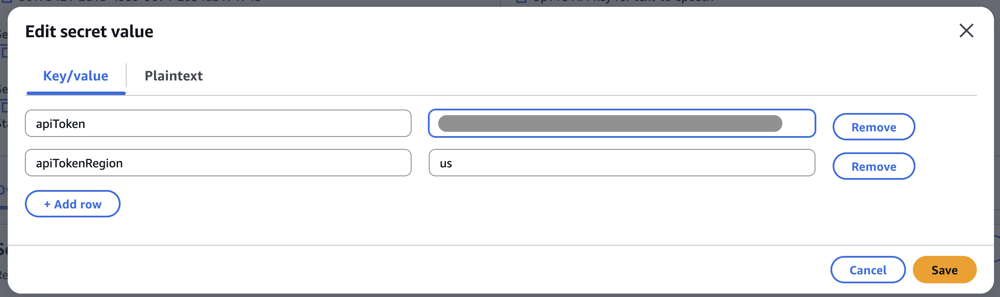
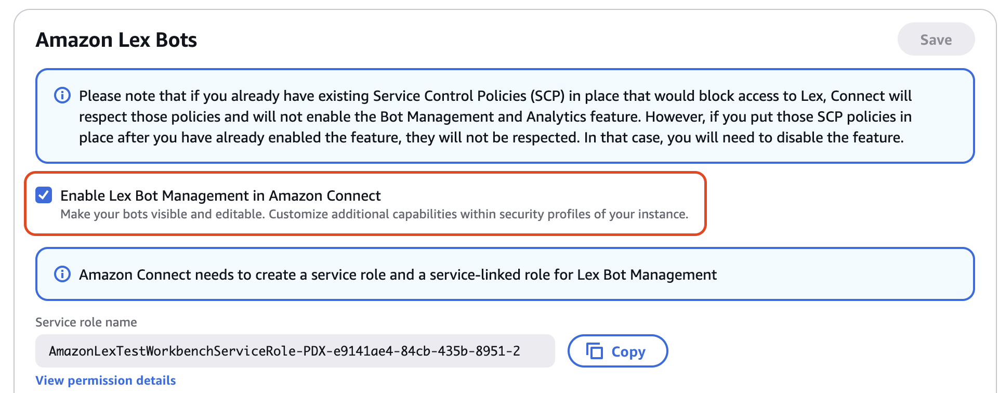
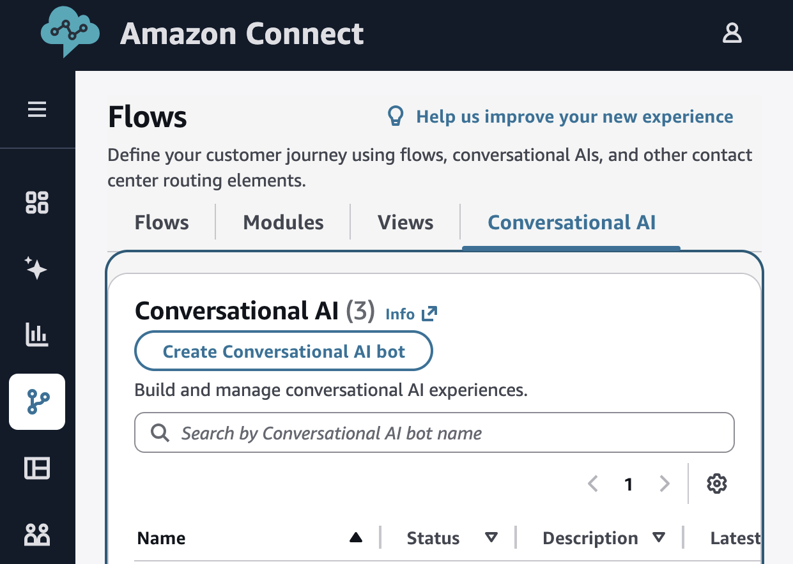
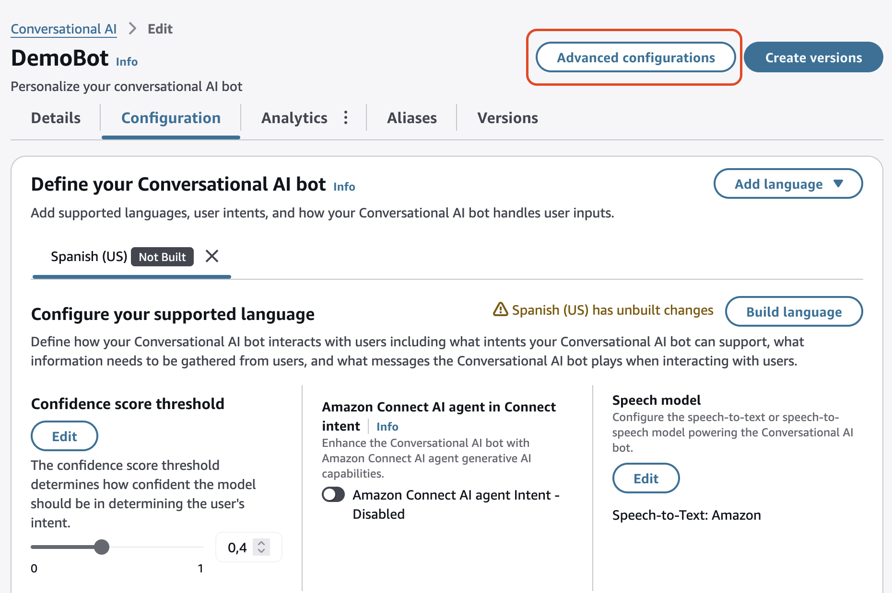
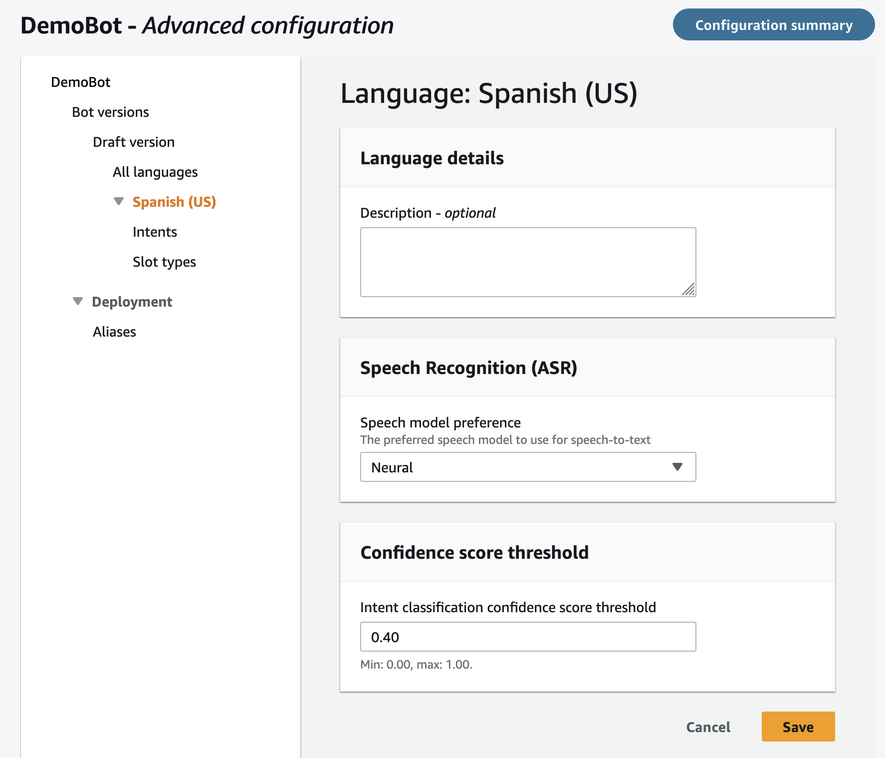
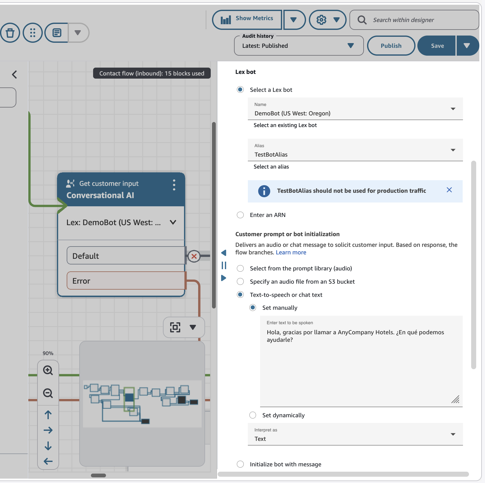

# Integrando Amazon Connect con voces Eleven Labs en español.

Si alguna vez has interactuado con un bot de voz y has pensado "esto suena demasiado robótico", tengo excelentes noticias para ti. 

## ¿Qué hay de nuevo?

En re:Invent 2025, AWS anunció tres opciones para llevar tus interacciones de voz al siguiente nivel:

1. **Amazon Nova Sonic** - El modelo S2S (Speech to speech) de Amazon para conversaciones naturales 
2. **ElevenLabs** - Síntesis de voz de alta calidad (TTS: Text to Speech)
3. **Deepgram** - Reconocimiento de voz de terceros con precisión mejorada (STT: Speech to text)

Es decir, además de Nova Sonic, Amazon Connect ahora te permite integrar proveedores de terceros para casos de uso especializados. Esto te da flexibilidad total mientras mantienes toda la orquestación, analítica y compliance de Amazon Connect.

Hoy vamos a profundizar en cómo utilizar voces de Eleven Labs dentro de la experiencia de una llamada telefónica con Amazon Connect. 

## ElevenLabs.io

ElevenLabs es conocido por sus voces sintéticas de altísima calidad y expresividad. 

**Características clave:**
- Voces ultra-realistas con múltiples emociones
- Soporte para español con acentos regionales. Escucha las opciones de acentos, tono, género y edad en el sitio [elevenlabs.io](https://elevenlabs.io/app/voice-library?required_languages=es). Por ejemplo [México](https://elevenlabs.io/app/voice-library?voiceId=YKUjKbMlejgvkOZlnnvt) 🇲🇽 [Chile](https://elevenlabs.io/app/voice-library?voiceId=cLzIVykddLltvgkzos6C) 🇨🇱 [Colombia](https://elevenlabs.io/app/voice-library?voiceId=57D8YIbQSuE3REDPO6Vm) 🇨🇴 [Argentina](https://elevenlabs.io/app/voice-library?voiceId=9oPKasc15pfAbMr7N6Gs) 🇦🇷. 
- Además de todas estas opciones, puedes [Clonar una voz](https://elevenlabs.io/voice-cloning)

Ahora puedes usarlo directamente en tus flujos de contacto de Amazon Connect y en los Bots de Amazon Lex utilizados en el flujo. A continuación te explico como:

## Configurando las voces de Eleven Labs en Amazon Connect.

Esta es la documentación oficial que usaremos de base: [Configure third-party text-to-speech (TTS) providers](https://docs.aws.amazon.com/connect/latest/adminguide/configure-third-party-tts.html) y realizaremos los cambios necesarios para escuchar las voces en español.

### Requisitos:

1. **[Amazon Connect con Unlimited AI](https://docs.aws.amazon.com/connect/latest/adminguide/enable-nextgeneration-amazonconnect.html)** (para usar ElevenLabs y otros modelos de terceros, **DEBE** tener Amazon Connect Unlimited AI).
2. Una cuenta de [ElevenLabs](https://elevenlabs.io/).
3. API Key de Eleven Labs que usará Amazon Connect para generar las voces:
    1. Ir a https://elevenlabs.io/app/developers/api-keys y crear una nueva clave. 
    
4. Almacena el API Key en [AWS Secrets Manager](https://docs.aws.amazon.com/connect/latest/adminguide/managing-secrets-resource-policies.html) ( Sigue los pasos para crear el secret y autorizar a Amazon Connect para leerlo).
    1. El secreto debe tener 2 claves: **apiToken** (el key de Eleven Labs) y **apiTokenRegion**: us para Latinoamérica.
    


### Paso 1: Configura el proveedor en tu flujo de Connect

1. Abre tu flujo de contacto en Amazon Connect
2. Agrega o edita un bloque **Set Voice**
3. Selecciona **Voice Provider: ElevenLabs**
5. En **Eleven Labs Model** ingresa manualmente una de las opciones: 
    - [eleven_multilingual_v2](https://elevenlabs.io/docs/overview/models#multilingual-v2). El más avanzado
    - [eleven_flash_v2_5](https://elevenlabs.io/docs/overview/models#flash-v25) para latencia reducida
    - [eleven_turbo_v2_5](https://elevenlabs.io/docs/overview/models#turbo-v25) Balance de velocidad y calidad

    [Más información acerca de la elección de Modelo](https://elevenlabs.io/docs/overview/models#model-selection-guide)
6.  **ElevenLabs Voice**: Pon el ID del modelo que quieres usar (que se obtiene en el sitio de eleven labs al seleccionar la voz)
7. **Secrets Manager ARN**: El ARN del secreto con el API key creado en [Requisitos](#requisitos)

8. **Other settings**:
    - Check **Set language attribute**
    - Language: Spanish (United States)

La configuración final de **Set Voice** queda como en la siguiente imagen (pudes modificar el modelo y la voz para probar otras opciones):
<div align="center">

</div>

Ahora ya puedes probar un **Play Prompt** con un mensaje, incluso puedes cambiar la voz dinámicamente y varias veces en un contacto:

<div align="center">

</div>

### Paso 2: Asocia el flujo a un número telefónico y realiza una llamada.

Este es un ejemplo de llamado usando dos modelos diferentes : eleven_turbo_v2_5 y eleven_multilingual_v2 y considerando voces de 3 países diferentes.


```
[AUDIO x 6]
Hola Que tal?
Yo soy una voz de Eleven Labs, con una acento {......}. 
Estas son las posibilidades actuales con la integración de voces de terceros en Amazon Connect. 
```

<div align="center">
<video width="300" height="480" controls>
  <source src="img/demo_eleven_labs.mp4" type="video/mp4">
</video>
</div>

[Abre el video en tu Navegador](https://private-user-images.githubusercontent.com/10731538/533219354-8a30009c-9fda-44e0-a6ef-99cee9e2a106.mp4?jwt=eyJ0eXAiOiJKV1QiLCJhbGciOiJIUzI1NiJ9.eyJpc3MiOiJnaXRodWIuY29tIiwiYXVkIjoicmF3LmdpdGh1YnVzZXJjb250ZW50LmNvbSIsImtleSI6ImtleTUiLCJleHAiOjE3Njc4NTYyODMsIm5iZiI6MTc2Nzg1NTk4MywicGF0aCI6Ii8xMDczMTUzOC81MzMyMTkzNTQtOGEzMDAwOWMtOWZkYS00NGUwLWE2ZWYtOTljZWU5ZTJhMTA2Lm1wND9YLUFtei1BbGdvcml0aG09QVdTNC1ITUFDLVNIQTI1NiZYLUFtei1DcmVkZW50aWFsPUFLSUFWQ09EWUxTQTUzUFFLNFpBJTJGMjAyNjAxMDglMkZ1cy1lYXN0LTElMkZzMyUyRmF3czRfcmVxdWVzdCZYLUFtei1EYXRlPTIwMjYwMTA4VDA3MDYyM1omWC1BbXotRXhwaXJlcz0zMDAmWC1BbXotU2lnbmF0dXJlPTk4Y2ZhMjJmNDU4YzQ3ZjFiZDVmNDhmMDJhYzg0YzdmODMyNmM4MjZhZjJmYmJmNjRkNjNmZTAyYWE1ODNhOGMmWC1BbXotU2lnbmVkSGVhZGVycz1ob3N0In0.g4rR4vjqH_YbcOfRl3Ftbi72PLaUdcuisi6LYS3dV3c)

## Usando Agente de IA dentro de Amazon Connect

Para incorporar la voz dentro de las interacciones con Amazon Lex debemos realizar algunos pasos adicionales.


### Recomendaciones

- Primero asegura que la voz funciona en **Play prompt** de Amazon Connect antes de pasar a configurar tu bot de Amazon Lex.
- Asegúrate que la gestión de los bots se realiza dentro de Connect. Esto lo puedes validar en la consola de Amazon Connect >> [Instancia] >> flows. De esta forma Amazon Connect Maneja los  roles y permisos necesarios.


<div align="center">

</div>

## Paso 1: Crea o configura un Bot de IA Conversacional en Amazon Connect


<div align="center">

</div>


1. Agrega (si no lo has hecho) lenguage **Spanish (US)**. El lenguage debe ser el mismo que seleccionaste en **Set Voice** de Amazon Connect (variable "language"="es_US se utiliza para identificar cuál idioma del bot se invoca desde Amazon Connect).
2. Crea un Intent Básico, algo como un **SaludoIntent** 
2. Ahora ve a la **Configuracion Avanzada**

<div align="center">

</div>

<div align="center">

</div>


3. Selecciona el lenguage **Spanish (US)** y edita la sección **Language details**
4. En **Speech Recognition (ASR)** Selecciona **Neural**
5. **Save** y **Build**.

<div align="center">

</div>

Nota: Estamos usando un modelo específico para Síntesis de Voz, en este paso le indicamos a Lex que modelo debería utilizar para Reconocimiento de Voz.


## Paso 2: Utiliza este Bot de IA Conversacional en un Flujo de Amazon Connect.

Configura el Bloque **Get Customer Input** con Lex como de costumbre:

<div align="center">

</div>

Es decir, esta parte no cambia. Debemos asegurar que la voz se encuentra establecida previo al bloque en **Set Voice** [Paso 1](#paso-1-configura-el-proveedor-en-tu-flujo-de-connect)


### Paso 2: Asocia el flujo a un número telefónico y realiza una llamada.

Este es un ejemplo de llamado usando dos modelos diferentes : eleven_turbo_v2_5 y eleven_multilingual_v2 y considerando voces de 3 países diferentes.


<div align="center">
<video width="300" height="480" controls>
  <source src="img/demo_conversational_ai.mp4" type="video/mp4">
</video>
</div>

[Abre el video en tu Navegador](https://private-user-images.githubusercontent.com/10731538/533681173-d8123b98-2eba-4075-bfba-59d09a4385ca.mp4?jwt=eyJ0eXAiOiJKV1QiLCJhbGciOiJIUzI1NiJ9.eyJpc3MiOiJnaXRodWIuY29tIiwiYXVkIjoicmF3LmdpdGh1YnVzZXJjb250ZW50LmNvbSIsImtleSI6ImtleTUiLCJleHAiOjE3Njc5MjQ2NjAsIm5iZiI6MTc2NzkyNDM2MCwicGF0aCI6Ii8xMDczMTUzOC81MzM2ODExNzMtZDgxMjNiOTgtMmViYS00MDc1LWJmYmEtNTlkMDlhNDM4NWNhLm1wND9YLUFtei1BbGdvcml0aG09QVdTNC1ITUFDLVNIQTI1NiZYLUFtei1DcmVkZW50aWFsPUFLSUFWQ09EWUxTQTUzUFFLNFpBJTJGMjAyNjAxMDklMkZ1cy1lYXN0LTElMkZzMyUyRmF3czRfcmVxdWVzdCZYLUFtei1EYXRlPTIwMjYwMTA5VDAyMDYwMFomWC1BbXotRXhwaXJlcz0zMDAmWC1BbXotU2lnbmF0dXJlPTM4NGQyMGVjYTBiY2Y2Zjk0ZmVkMWQyNTQ4MjgxM2NhNWQ2ZmE3YmE5ZTE0YmNjMDZjZjVmNWJjYjVjZDQ4MmImWC1BbXotU2lnbmVkSGVhZGVycz1ob3N0In0.GNXyqw9eLC6TkWbHyqFQks5_dAsAgUdXj2TS5DFsrn4)


Si quieres construir una experiencia similar a esta llamada de demo, puedes hacerlo siguiendo este workshop: [Building Intelligent Customer Service with Agentic AI on Amazon Connect](https://catalog.workshops.aws/self-service-ai-agents/en-US)

## Consideraciones de Costos

- Facturación de uso de síntesis de voz es directamente con el proveedor Eleven Labs. Precios según el plan que contrates con ellos (aunque esta prueba la realicé con su capa gratuita)
- El acceso a configurar la integración está incluido en Connect Unlimited AI


## Recursos Adicionales

### Documentación Oficial:

- [Configurar proveedores TTS de terceros](https://docs.aws.amazon.com/connect/latest/adminguide/configure-third-party-tts.html)
- [Endpoints y regiones para proveedores de terceros](https://docs.aws.amazon.com/connect/latest/adminguide/endpoints-regions-third-party-stt.html)

### Blogs y Anuncios:

- [Amazon Connect en re:Invent 2025](https://aws.amazon.com/blogs/contact-center/amazon-connect-at-reinvent-2025-creating-the-future-of-customer-experience-with-ai/)
- [Liderando la conversación con IA conversacional](https://aws.amazon.com/blogs/contact-center/leading-the-conversation-with-conversational-ai-in-amazon-connect/)
- [Anuncio oficial de self-service agéntico](https://aws.amazon.com/about-aws/whats-new/2025/11/amazon-connect-agentic-self-service/)

### Sesiones de re:Invent:

- **[BIZ 221](https://www.youtube.com/watch?v=sq5FNe2_JzI)**: Agentic AI advancements in customer experience with Amazon Connect


¿Tienes preguntas sobre cómo implementar estas nuevas voces en tu contact center? ¿Quieres compartir tu experiencia? Déjame un comentario abajo o contáctame directamente. 


