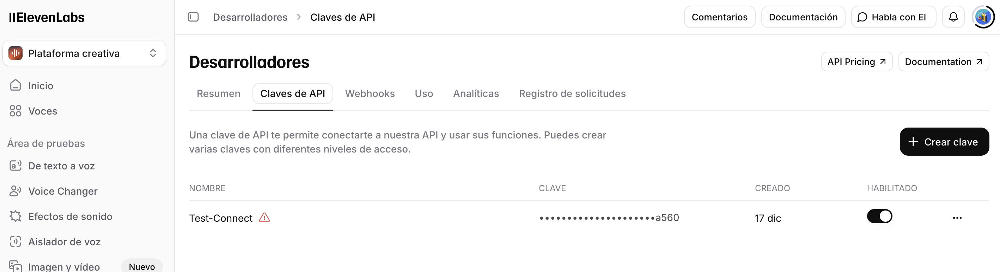
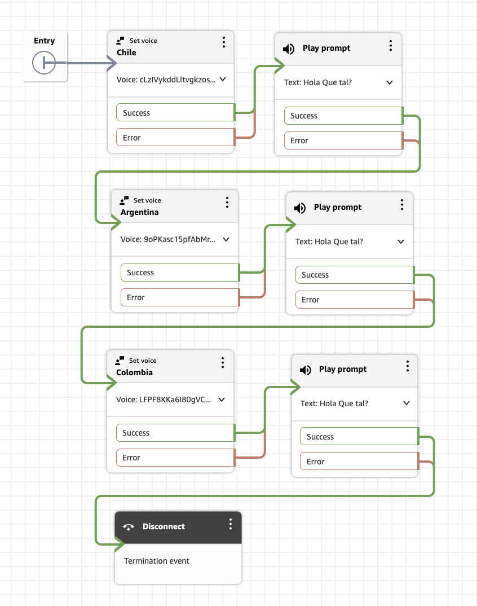

# Integrando Amazon Connect con voces Eleven Labs en español.

Si alguna vez has interactuado con un bot de voz y has pensado "esto suena demasiado robótico", tengo excelentes noticias para ti. 

## ¿Qué hay de nuevo?

En re:Invent 2025, AWS anunció tres opciones para llevar tus interacciones de voz al siguiente nivel:

1. **Amazon Nova Sonic** - El modelo S2S (Speech to speech) para conversaciones naturales
2. **ElevenLabs** - Síntesis de voz de alta calidad (TTS: Text to Speech)
3. **Deepgram** - Reconocimiento de voz de terceros con precisión mejorada (STT: Speech to text)

Es decir, además de Nova Sonic, Amazon Connect ahora te permite integrar proveedores de terceros para casos de uso especializados. Esto te da flexibilidad total mientras mantienes toda la orquestación, analítica y compliance de Amazon Connect.

Hoy vamos a profundizar en cómo utilizar voces de Eleven Labs dentro de la experiencia de una llamada telefónica con Amazon Connect. 

## ElevenLabs.io

ElevenLabs es conocido por sus voces sintéticas de altísima calidad y expresividad. 

**Características clave:**
- Voces ultra-realistas con múltiples emociones
- Soporte para español con acentos regionales. Escucha las opciones de acentos, tono, género y edad en el sitio [elevenlabs.io](https://elevenlabs.io/app/voice-library?required_languages=es). Por ejemplo [México](https://elevenlabs.io/app/voice-library?voiceId=YKUjKbMlejgvkOZlnnvt) 🇲🇽 [Chile](https://elevenlabs.io/app/voice-library?voiceId=cLzIVykddLltvgkzos6C) 🇨🇱 [Colombia](https://elevenlabs.io/app/voice-library?voiceId=57D8YIbQSuE3REDPO6Vm) 🇨🇴 [Argentina](https://elevenlabs.io/app/voice-library?voiceId=9oPKasc15pfAbMr7N6Gs) 🇦🇷. 
- Además de todas estas opciones, puedes [Clonar una voz](https://elevenlabs.io/voice-cloning)

Ahora puedes usarlo directamente en tus flujos de contacto de Amazon Connect.

## Configurando las voces de Eleven Labs en Amazon Connect.

Esta es la documentación oficial que usaremos de base: [Configure third-party text-to-speech (TTS) providers](https://docs.aws.amazon.com/connect/latest/adminguide/configure-third-party-tts.html) y realizaremos los cambios necesarios para escuchar las voces en español.

### Requisitos:

1. **[Amazon Connect con Unlimited AI](https://docs.aws.amazon.com/connect/latest/adminguide/enable-nextgeneration-amazonconnect.html)** (para usar ElevenLabs y otros modelos de terceros, **DEBE** tener Amazon Connect Unlimited AI).
2. Una cuenta de [ElevenLabs](https://elevenlabs.io/).
3. API Key de Eleven Labs que usará Amazon Connect para generar las voces:
    1. Ir a https://elevenlabs.io/app/developers/api-keys y crear una nueva clave. 
    
4. Almacena el API Key en [AWS Secrets Manager](https://docs.aws.amazon.com/connect/latest/adminguide/managing-secrets-resource-policies.html) ( Sigue los pasos para crear el secret y autorizar a Amazon Connect para leerlo)

### Paso 1: Configura el proveedor en tu flujo de Connect

1. Abre tu flujo de contacto en Amazon Connect
2. Agrega o edita un bloque **Set Voice**
3. Selecciona **Voice Provider: ElevenLabs**
5. En **Eleven Labs Model** ingresa manualmente una de las opciones: 
    - [eleven_multilingual_v2](https://elevenlabs.io/docs/overview/models#multilingual-v2). El más avanzado
    - [eleven_flash_v2_5](https://elevenlabs.io/docs/overview/models#flash-v25) para latencia reducida
    - [eleven_turbo_v2_5](https://elevenlabs.io/docs/overview/models#turbo-v25) Balance de velocidad y calidad

    [Más información acerca de la elección de Modelo](https://elevenlabs.io/docs/overview/models#model-selection-guide)
6.  **ElevenLabs Voice**: Pon el ID del modelo que quieres usar (que se obtiene en el sitio de eleven labs al seleccionar la voz)
7. **Secrets Manager ARN**: El ARN del secreto con el API key creado en [Requisitos](#requisitos)

8. **Other settings**:
    - Check **Set language attribute**
    - Language: Spanish (United States)

La configuración final de **Set Voice** queda como en la siguiente imagen (pudes modificar el modelo y la voz para probar otras opciones):


Ahora ya puedes probar un **Play Prompt** con un mensaje, incluso puedes cambiar la voz dinámicamente y varias veces en un contacto:




### Paso 2: Asocia el flujo a un número telefónico y realiza una llamada.

Este es un ejemplo de llamado usando dos modelos diferentes : eleven_turbo_v2_5 y eleven_multilingual_v2 y considerando voces de 3 países diferentes.

<video width="640" height="480" controls>
  <source src="https://private-user-images.githubusercontent.com/10731538/533219354-8a30009c-9fda-44e0-a6ef-99cee9e2a106.mp4?jwt=eyJ0eXAiOiJKV1QiLCJhbGciOiJIUzI1NiJ9.eyJpc3MiOiJnaXRodWIuY29tIiwiYXVkIjoicmF3LmdpdGh1YnVzZXJjb250ZW50LmNvbSIsImtleSI6ImtleTUiLCJleHAiOjE3Njc4NTYyODMsIm5iZiI6MTc2Nzg1NTk4MywicGF0aCI6Ii8xMDczMTUzOC81MzMyMTkzNTQtOGEzMDAwOWMtOWZkYS00NGUwLWE2ZWYtOTljZWU5ZTJhMTA2Lm1wND9YLUFtei1BbGdvcml0aG09QVdTNC1ITUFDLVNIQTI1NiZYLUFtei1DcmVkZW50aWFsPUFLSUFWQ09EWUxTQTUzUFFLNFpBJTJGMjAyNjAxMDglMkZ1cy1lYXN0LTElMkZzMyUyRmF3czRfcmVxdWVzdCZYLUFtei1EYXRlPTIwMjYwMTA4VDA3MDYyM1omWC1BbXotRXhwaXJlcz0zMDAmWC1BbXotU2lnbmF0dXJlPTk4Y2ZhMjJmNDU4YzQ3ZjFiZDVmNDhmMDJhYzg0YzdmODMyNmM4MjZhZjJmYmJmNjRkNjNmZTAyYWE1ODNhOGMmWC1BbXotU2lnbmVkSGVhZGVycz1ob3N0In0.g4rR4vjqH_YbcOfRl3Ftbi72PLaUdcuisi6LYS3dV3c" type="video/mp4">
  Tu navegador no soporta el elemento de video.
</video>


<video width="640" height="480" controls>
  <source src="img/demo_eleven_labs.mp4" type="video/mp4">
  [Abre el video en tu Navegador]("https://private-user-images.githubusercontent.com/10731538/533219354-8a30009c-9fda-44e0-a6ef-99cee9e2a106.mp4?jwt=eyJ0eXAiOiJKV1QiLCJhbGciOiJIUzI1NiJ9.eyJpc3MiOiJnaXRodWIuY29tIiwiYXVkIjoicmF3LmdpdGh1YnVzZXJjb250ZW50LmNvbSIsImtleSI6ImtleTUiLCJleHAiOjE3Njc4NTYyODMsIm5iZiI6MTc2Nzg1NTk4MywicGF0aCI6Ii8xMDczMTUzOC81MzMyMTkzNTQtOGEzMDAwOWMtOWZkYS00NGUwLWE2ZWYtOTljZWU5ZTJhMTA2Lm1wND9YLUFtei1BbGdvcml0aG09QVdTNC1ITUFDLVNIQTI1NiZYLUFtei1DcmVkZW50aWFsPUFLSUFWQ09EWUxTQTUzUFFLNFpBJTJGMjAyNjAxMDglMkZ1cy1lYXN0LTElMkZzMyUyRmF3czRfcmVxdWVzdCZYLUFtei1EYXRlPTIwMjYwMTA4VDA3MDYyM1omWC1BbXotRXhwaXJlcz0zMDAmWC1BbXotU2lnbmF0dXJlPTk4Y2ZhMjJmNDU4YzQ3ZjFiZDVmNDhmMDJhYzg0YzdmODMyNmM4MjZhZjJmYmJmNjRkNjNmZTAyYWE1ODNhOGMmWC1BbXotU2lnbmVkSGVhZGVycz1ob3N0In0.g4rR4vjqH_YbcOfRl3Ftbi72PLaUdcuisi6LYS3dV3c")
</video>

## Consideraciones de Costos

- Facturación de uso de síntesis de voz es directamente con el proveedor Eleven Labs. Precios según el plan que contrates con ellos (aunque esta prueba la realicé con su capa gratuita)
- El acceso a configurar la integración está incluido en Connect Unlimited AI


**Descripción del audio**: Conversación natural con tono amigable, sin pausas robóticas, con entonación que refleja empatía y profesionalismo.

---

#### ElevenLabs - Voz Personalizada
**Escenario**: Mensaje de bienvenida

```
[AUDIO PLAYER]
Bot: "Bienvenido a TechSupport Plus. Mi nombre es Ana y estoy aquí para ayudarte a resolver cualquier problema técnico que tengas. Por favor, cuéntame qué está pasando y trabajaremos juntos para solucionarlo."
```

**Descripción del audio**: Voz cálida y profesional con excelente claridad, pronunciación perfecta y ritmo natural.

---

#### Comparación: TTS Tradicional vs Nova Sonic
**Escenario**: Misma frase con diferentes tecnologías

```
[AUDIO PLAYER - SPLIT COMPARISON]
TTS Tradicional: "Su. Solicitud. Ha. Sido. Procesada. Exitosamente. Recibirá. Una. Confirmación. Por. Correo. Electrónico."

Nova Sonic: "Tu solicitud ha sido procesada exitosamente. Recibirás una confirmación por correo electrónico en los próximos minutos."
```

**Descripción del audio**: Comparación lado a lado mostrando la diferencia dramática en naturalidad, fluidez y expresividad.

---

## Recursos Adicionales

### Documentación Oficial:

- [Configurar Amazon Nova Sonic](https://docs.aws.amazon.com/connect/latest/adminguide/nova-sonic-speech-to-speech.html)
- [Configurar proveedores TTS de terceros](https://docs.aws.amazon.com/connect/latest/adminguide/configure-third-party-tts.html)
- [Configurar proveedores STT de terceros](https://docs.aws.amazon.com/connect/latest/adminguide/configure-third-party-stt.html)
- [Endpoints y regiones para proveedores de terceros](https://docs.aws.amazon.com/connect/latest/adminguide/endpoints-regions-third-party-stt.html)

### Blogs y Anuncios:

- [Amazon Connect en re:Invent 2025](https://aws.amazon.com/blogs/contact-center/amazon-connect-at-reinvent-2025-creating-the-future-of-customer-experience-with-ai/)
- [Liderando la conversación con IA conversacional](https://aws.amazon.com/blogs/contact-center/leading-the-conversation-with-conversational-ai-in-amazon-connect/)
- [Anuncio oficial de self-service agéntico](https://aws.amazon.com/about-aws/whats-new/2025/11/amazon-connect-agentic-self-service/)

### Sesiones de re:Invent:

- **BIZ 221**: Agentic AI advancements in customer experience with Amazon Connect

## Conclusión

Las nuevas capacidades de voz en Amazon Connect representan un salto cualitativo en cómo podemos servir a nuestros clientes hispanohablantes. Ya sea que elijas Amazon Nova Sonic para conversaciones completamente naturales, o combines ElevenLabs y Deepgram para casos de uso especializados, ahora tienes las herramientas para crear experiencias de voz que realmente deleiten a tus clientes.

Lo mejor de todo: estas tecnologías están disponibles **ahora mismo** y son fáciles de implementar. No necesitas ser un experto en IA o machine learning para empezar a usarlas.

### Próximos Pasos:

1. **Evalúa** tus casos de uso actuales y identifica dónde las voces naturales pueden tener mayor impacto
2. **Prueba** Nova Sonic en un ambiente de desarrollo con tus propios flujos
3. **Compara** las diferentes opciones con llamadas de prueba reales
4. **Implementa** gradualmente, empezando con un flujo de bajo riesgo
5. **Mide** el impacto en satisfacción del cliente y eficiencia operativa

¿Tienes preguntas sobre cómo implementar estas nuevas voces en tu contact center? ¿Quieres compartir tu experiencia? Déjame un comentario abajo o contáctame directamente. Estoy aquí para ayudarte a llevar tu experiencia de cliente al siguiente nivel.

¡Hasta la próxima!

---

**Sobre el autor**: Arquitecto de Soluciones Senior de Amazon Connect para Latinoamérica, especializado en IA conversacional y experiencia del cliente. Apasionado por ayudar a empresas a transformar sus contact centers con tecnología de punta.

**Tags**: #AmazonConnect #NovaSonic #ContactCenter #IA #VoiceAI #CustomerExperience #AWS #Latinoamérica #ElevenLabs #Deepgram
